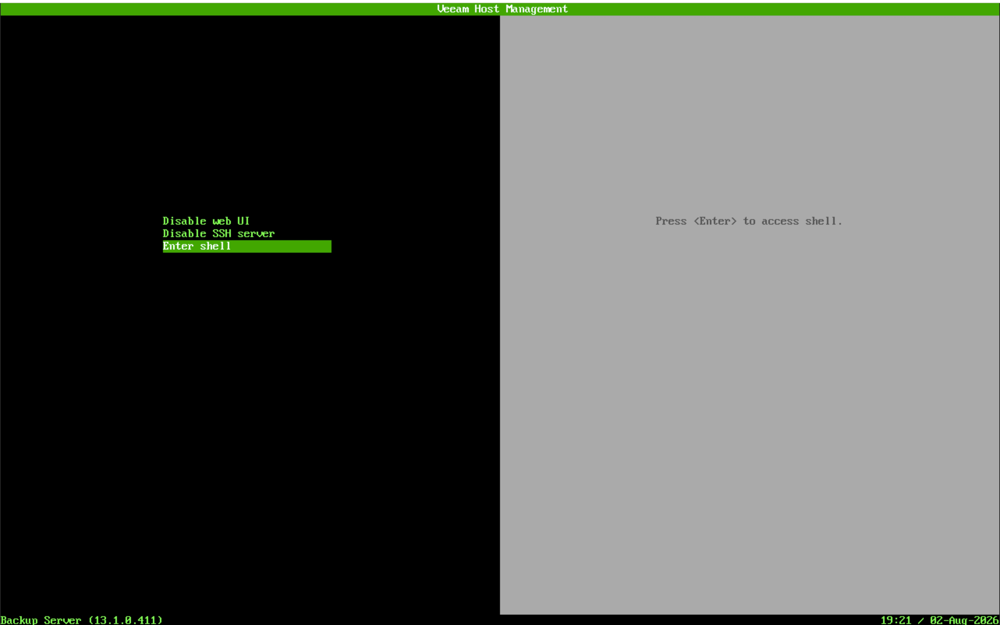
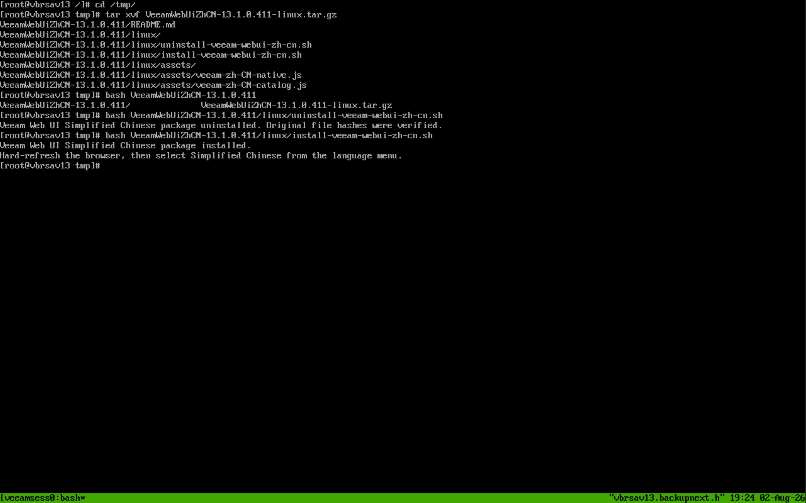
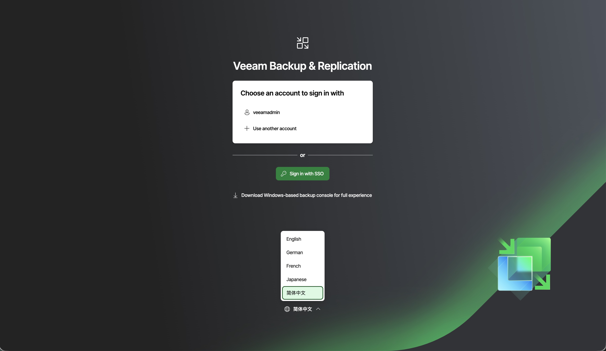
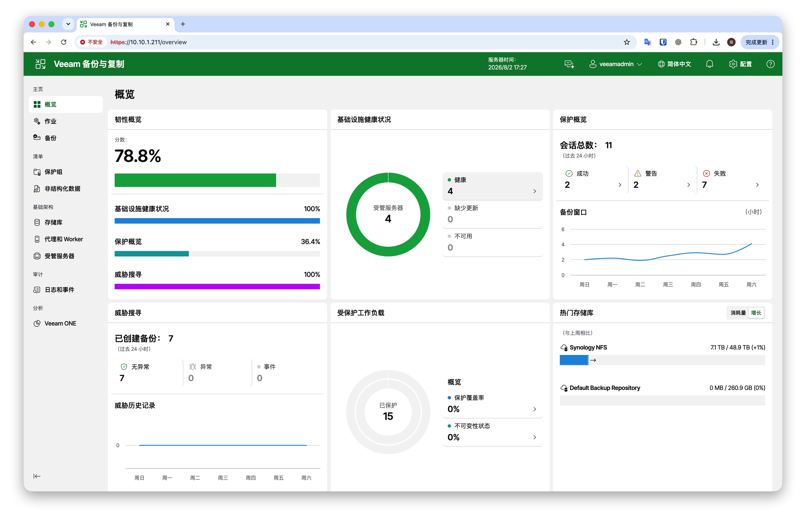
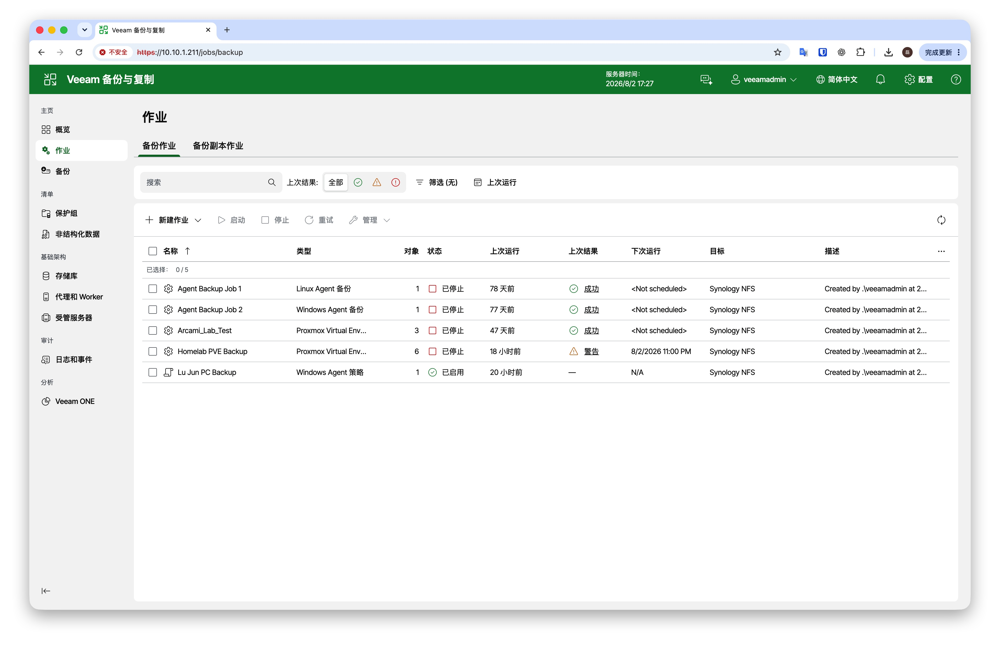
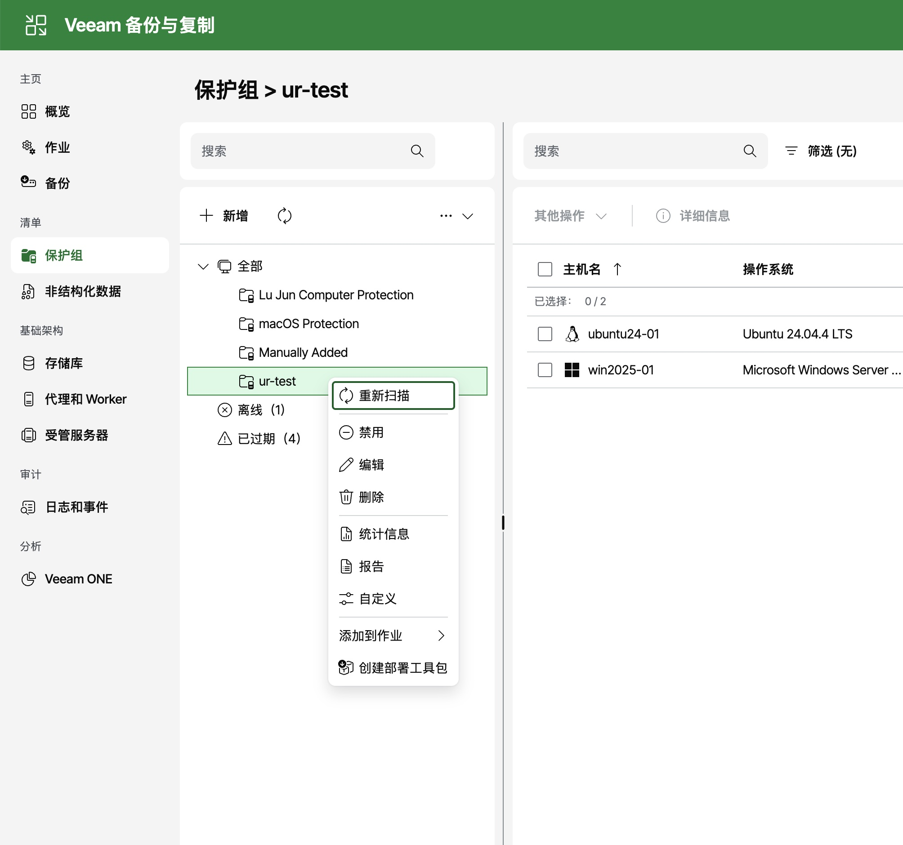
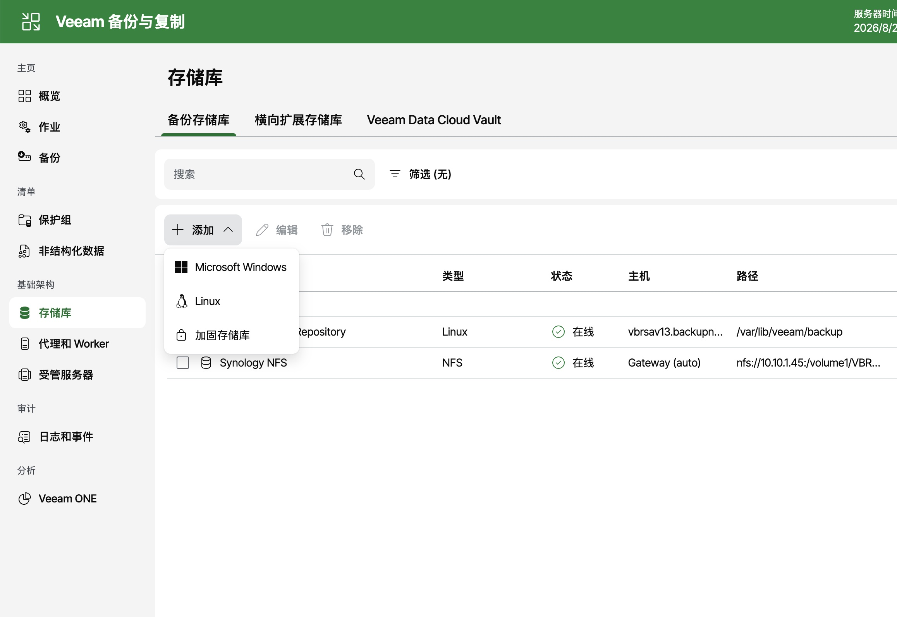
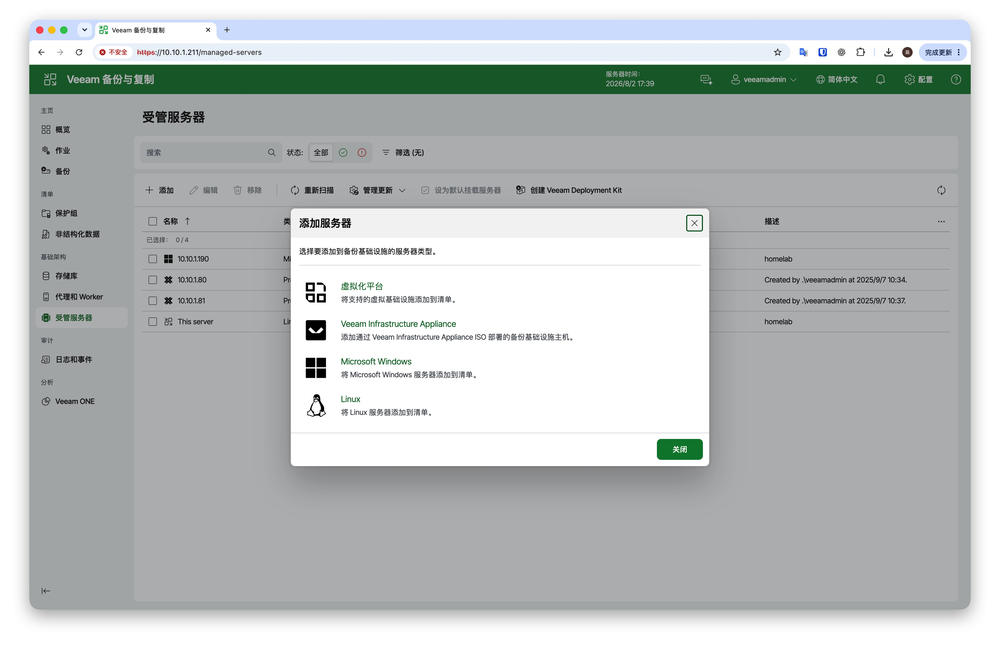

# Veeam 中文 UI 本地化包

这里存放 Veeam 产品 Web UI 的非官方简体中文本地化包。

当前已发布：

- Veeam Backup & Replication Web UI 简体中文包

未来如果制作 Veeam ONE、Veeam Recovery Orchestrator 等产品的中文 UI 包，也会按产品分类放在本仓库中。

## 目录结构

```text
VBR WebUI Chinese Package/
├── VBR-13.0.2.29/
│   ├── VeeamWebUiZhCN-13.0.2.29-linux.tar.gz
│   └── SHA256SUMS-13.0.2.29.txt
│
└── VBR-13.1.0.411/
    ├── VeeamWebUiZhCN-13.1.0.411-linux.tar.gz
    ├── VeeamWebUiZhCN-13.1.0.411-windows.zip
    ├── VeeamWebUiZhCN-13.1.0.411-full.zip
    └── SHA256SUMS-13.1.0.411.txt
```

目录中的版本号必须与 Veeam Backup & Replication Web UI build 匹配。请不要把不同 build 的包混用。

## VBR Web UI 中文包说明

此包会在 Veeam Backup & Replication Web UI 中增加“简体中文”语言选项，不覆盖原有 English、German、French、Japanese。

当前支持版本：

| 产品 | Web UI build | 环境 | 翻译覆盖率 | 目录 |
| --- | --- | --- | --- | --- |
| Veeam Backup & Replication | `13.0.2.29` | Linux Appliance / VSA | `99.97%`，仅剩 2 条空字符串资源 | `VBR WebUI Chinese Package/VBR-13.0.2.29/` |
| Veeam Backup & Replication | `13.1.0.411` | Linux Appliance / Windows | 完整发布包 | `VBR WebUI Chinese Package/VBR-13.1.0.411/` |

## 快速下载

### VBR 13.0.2.29 Linux Appliance

| 适用环境 | 下载文件 |
| --- | --- |
| Linux Appliance / VSA | [VeeamWebUiZhCN-13.0.2.29-linux.tar.gz](https://github.com/Coku2015/Veeam-Chinese-UI-Packages/raw/main/VBR%20WebUI%20Chinese%20Package/VBR-13.0.2.29/VeeamWebUiZhCN-13.0.2.29-linux.tar.gz) |
| SHA256 校验文件 | [SHA256SUMS-13.0.2.29.txt](https://github.com/Coku2015/Veeam-Chinese-UI-Packages/raw/main/VBR%20WebUI%20Chinese%20Package/VBR-13.0.2.29/SHA256SUMS-13.0.2.29.txt) |

此版本从已审校的 `13.1.0.411` 中文目录迁移而来，并对旧版专有文本进行人工翻译。旧版 `6102` 条资源中已覆盖 `6100` 条：包含 `77` 条经过审校的 13.1 文案变化映射，以及 `602` 条人工翻译资源。剩余 2 条原文本身为空字符串，不会在界面显示。

### VBR 13.1.0.411

请根据你的 Veeam Backup & Replication 部署类型下载对应安装包。

| 适用环境 | 下载文件 |
| --- | --- |
| Linux Appliance / VSA | [VeeamWebUiZhCN-13.1.0.411-linux.tar.gz](https://github.com/Coku2015/Veeam-Chinese-UI-Packages/raw/main/VBR%20WebUI%20Chinese%20Package/VBR-13.1.0.411/VeeamWebUiZhCN-13.1.0.411-linux.tar.gz) |
| Windows Backup Server | [VeeamWebUiZhCN-13.1.0.411-windows.zip](https://github.com/Coku2015/Veeam-Chinese-UI-Packages/raw/main/VBR%20WebUI%20Chinese%20Package/VBR-13.1.0.411/VeeamWebUiZhCN-13.1.0.411-windows.zip) |
| 完整包，包含 Windows 和 Linux | [VeeamWebUiZhCN-13.1.0.411-full.zip](https://github.com/Coku2015/Veeam-Chinese-UI-Packages/raw/main/VBR%20WebUI%20Chinese%20Package/VBR-13.1.0.411/VeeamWebUiZhCN-13.1.0.411-full.zip) |
| SHA256 校验文件 | [SHA256SUMS-13.1.0.411.txt](https://github.com/Coku2015/Veeam-Chinese-UI-Packages/raw/main/VBR%20WebUI%20Chinese%20Package/VBR-13.1.0.411/SHA256SUMS-13.1.0.411.txt) |

也可以直接浏览版本目录：

[VBR WebUI Chinese Package / VBR-13.1.0.411](https://github.com/Coku2015/Veeam-Chinese-UI-Packages/tree/main/VBR%20WebUI%20Chinese%20Package/VBR-13.1.0.411)

## Linux Appliance 安装

### 安装 VBR 13.0.2.29 中文包

```bash
curl -L -o VeeamWebUiZhCN-13.0.2.29-linux.tar.gz "https://github.com/Coku2015/Veeam-Chinese-UI-Packages/raw/main/VBR%20WebUI%20Chinese%20Package/VBR-13.0.2.29/VeeamWebUiZhCN-13.0.2.29-linux.tar.gz"
```

上传到 Appliance 的 `/tmp/` 后，在 Appliance Console 的 root shell 中执行：

```bash
cd /tmp
tar xvf VeeamWebUiZhCN-13.0.2.29-linux.tar.gz
bash VeeamWebUiZhCN-13.0.2.29/linux/install-veeam-webui-zh-cn.sh
```

卸载还原：

```bash
cd /tmp
bash VeeamWebUiZhCN-13.0.2.29/linux/uninstall-veeam-webui-zh-cn.sh
```

### 安装 VBR 13.1.0.411 中文包

标准流程：

1. 进入 Veeam Appliance Console。
2. 选择 `Enable SSH server`，启用 SSH。
3. 在本机下载 Linux 安装包。
4. 在本机通过 `scp` 将安装包上传到 Appliance 的 `/tmp/` 目录。
5. 回到 Veeam Appliance Console，选择 `Enter shell` 进入 Shell。
6. 在 `/tmp` 中解压并执行安装脚本。

在本机下载 Linux 安装包：

```bash
curl -L -o VeeamWebUiZhCN-13.1.0.411-linux.tar.gz "https://github.com/Coku2015/Veeam-Chinese-UI-Packages/raw/main/VBR%20WebUI%20Chinese%20Package/VBR-13.1.0.411/VeeamWebUiZhCN-13.1.0.411-linux.tar.gz"
```

如果不使用命令行下载，也可以在浏览器中点击：

[下载 Linux 安装包](https://github.com/Coku2015/Veeam-Chinese-UI-Packages/raw/main/VBR%20WebUI%20Chinese%20Package/VBR-13.1.0.411/VeeamWebUiZhCN-13.1.0.411-linux.tar.gz)

上传安装包：

```bash
scp VeeamWebUiZhCN-13.1.0.411-linux.tar.gz veeamadmin@vbrvsaip:/tmp/
```

其中 `vbrvsaip` 请替换为你的 Veeam Backup Server / Linux Appliance 主机名或 IP。

进入 Appliance Shell 后执行：

```bash
cd /tmp
tar xvf VeeamWebUiZhCN-13.1.0.411-linux.tar.gz
bash VeeamWebUiZhCN-13.1.0.411/linux/install-veeam-webui-zh-cn.sh
```

安装后刷新浏览器，选择“简体中文”。

卸载还原：

```bash
cd /tmp
bash VeeamWebUiZhCN-13.1.0.411/linux/uninstall-veeam-webui-zh-cn.sh
```

### Linux Appliance 操作截图

启用 SSH Server：



进入 Shell 安装：



Web UI 简体中文效果：













## Windows 安装

在 Veeam Backup Server 上，以管理员身份打开 PowerShell。

下载安装包：

```powershell
Invoke-WebRequest -Uri "https://github.com/Coku2015/Veeam-Chinese-UI-Packages/raw/main/VBR%20WebUI%20Chinese%20Package/VBR-13.1.0.411/VeeamWebUiZhCN-13.1.0.411-windows.zip" -OutFile "$env:USERPROFILE\Downloads\VeeamWebUiZhCN-13.1.0.411-windows.zip"
```

解压并安装：

```powershell
Expand-Archive -LiteralPath "$env:USERPROFILE\Downloads\VeeamWebUiZhCN-13.1.0.411-windows.zip" -DestinationPath "$env:USERPROFILE\Downloads" -Force
Set-ExecutionPolicy -Scope Process Bypass
cd "$env:USERPROFILE\Downloads\VeeamWebUiZhCN-13.1.0.411\windows"
.\Install-VeeamWebUiZhCN.ps1
```

安装后浏览器按 `Ctrl+F5` 强制刷新，然后选择“简体中文”。

卸载还原：

```powershell
Set-ExecutionPolicy -Scope Process Bypass
cd "$env:USERPROFILE\Downloads\VeeamWebUiZhCN-13.1.0.411\windows"
.\Uninstall-VeeamWebUiZhCN.ps1
```

## 校验文件

每个版本目录中提供 `SHA256SUMS-<build>.txt`，可用于校验下载文件完整性。

下载校验文件：

```bash
curl -L -o SHA256SUMS-13.1.0.411.txt "https://github.com/Coku2015/Veeam-Chinese-UI-Packages/raw/main/VBR%20WebUI%20Chinese%20Package/VBR-13.1.0.411/SHA256SUMS-13.1.0.411.txt"
```

Linux/macOS：

```bash
shasum -a 256 -c SHA256SUMS-13.1.0.411.txt
```

Windows PowerShell 可使用：

```powershell
Get-FileHash .\VeeamWebUiZhCN-13.1.0.411-windows.zip -Algorithm SHA256
```

## 注意事项

- 这是非官方本地化包，不是 Veeam 官方 hotfix。
- 安装前请确认 Veeam Web UI build 与目录版本一致。
- 建议在升级 Veeam 前先卸载本地化包，升级完成后再安装匹配新 build 的中文包。
- 安装脚本会备份被修改的 Web UI 静态文件，卸载脚本会校验并还原。
- 如果安装脚本提示 hash 不匹配，说明 Veeam 文件可能已升级或被修改，请不要强行安装不匹配版本。
